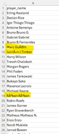
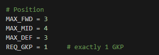

# Fantasy Premier League Project

# Executive Summary

The purpose of this project is to identify trends within data to see if there could be any benefits for competing in the overall league related to FPL (Fantasy Premier League) for the current football season where the dataset holds statistics for players and teams. The data is downloaded from a public source website called Kaggle which appears to be updated by the user on a weekly basis. This data is downloaded manually to a local machine via a csv file. The privacy risks associated that need to be considered when downloading directly from a public website to a local machine are what else could being downloaded if there has been a security breach? 
There is also the possibility is bias data depending on if a user has made changes to the data before initial download which could result in incorrect analysis. With this dataset the user has published the remote source and a link to the scraper for reassurance.
The use of this data will to be evaluate if a Linear Regression model can be used to take advantage during the time a person would use their Wildcard where they can change the entire team. This is available twice during a season. This would then be evaluated on a metric that can be changed based on the user preferences from what columns they want to include. Further down the line this would then be evaluated based on the performance in league tables after the Wildcard has taken place. 

# Data Engineering
The file will then have EDA (Exploratory Data Analysis) via visual inspection of columns to see if any errors stand out within the data.
  
As shown here it is already identifiable that there are issues with the player names. This is due to the limitations in excel of characters in the data i.e. Jurriën J.Timber, a solution to this if it’s minimal this happens to manually update in the file and this would be easy for someone who would easily work out which player it is but may require research for others. Another issue could be duplicates within the data. A quick check for this would be to use excel’ s Conditional Formatting on the player’s name and choosing highlight duplicate values. In this instance there were 0 duplicate values within the dataset. As someone may want to use different columns for later analysis then it would be best to keep these columns but there is the issue of thinking data is incomplete for some fields i.e. a Keeper may not have many or any shooting stats. This would not mean the data does not follow the framework of completeness.
  
Ensuring the data is covering the UK Government data quality framework is important but can be a struggle with public data as for example how would people know how accurate the data is? Downloading the latest data would cover this but if the data is incorrect at source, then corrected later this would need to be updated in the file that has been downloaded. Data is fundamental to effective, evidence-based decision-making. It underpins everything from major policy decisions to routine operational process. Often, however, our data is of unknown or questionable quality. GOV.UK (2026)

# Data Infrastructure and Tools
One of the tools used will be VS (Visual Studios). Visual Studio is a powerful developer tool that you can use to complete the entire development cycle in one place. It's a comprehensive integrated development environment (IDE) that you can use to write, edit, debug, and build code, and then deploy your app. Microsoft Learn(2025). This will then be integrated with Python coding to help perform some EDA then data analytics. Python is an interpreted, object-oriented, high-level programming language with dynamic semantics. Its high-level built in data structures, combined with dynamic typing and dynamic binding, make it very attractive for Rapid Application Development, as well as for use as a scripting or glue language to connect existing components together. Python (2025). These tools were chosen as Python can be easily integrated into Visual Studio to perform visualisations. Python also has various packages that can be downloaded to help with data analytics. If a package can’t be used due to a business’s security restrictions alternatives can be used.
These tools were chosen to alternatives such as Oracle and Microsoft Structured Query Language as they fit the purpose of the project for identifying trends in data as compared to these tools using VS and Python are more adapted to creating a type of machine learning model using the various packages withing Python.

# Data Analytics
The hypothesis, can an advantage gained through wildcarding will try to be assessed using a Linear Regression model to pick the best starting 11 players after a season has commenced. As there are no date columns within the data this would rule out a Time Series Analysis of the data as this requires a good amount of historical data. The most logical type of analysis would be Linear or Logistic regression. Linear regression and logistic regression are machine learning techniques that make predictions by analyzing historical data. For example, by looking at past customer purchase trends, regression analysis estimates future sales, so you can make more informed inventory purchases. Linear regression techniques mathematically model the unknown factor on multiple known factors to estimate the exact unknown value. Similarly, logistic regression uses mathematics to find the relationships between two data factors. It then uses this relationship to predict the value of one of those factors based on the other. The prediction usually has a finite number of outcomes, like yes or no. AWS(2026).
In Kaggle, a user had provided code for an algorithm using linear regression to help with picking players during wildcarding. This code had to be changed due to possible security concerns around the packages being downloaded.
In terms of the data analysis, there is various metrics that can attribute to a player being valuable for selection once a run of games has set in. The two that are focused on in the Linear regression model that was Total Points, Form and Bonus points where these numerical values fit a linear regression model. 
  
These metrics will be used to evaluate the initial choices for the wildcard.
  
This is then based on the budget available which is 100m but depending on players initial choices at the start of a season, a player can increase in value if they hit the ground running so a player’s budget can be more than this or less if they have players who’ve decreased in value. Another metric to consider is the player positions. You able to have 2 Goalkeepers, 5 Defenders, 5 Midfielders and 3 Forwards. The model is based on preference of initial formation for the starting 11 or can also be based on the whole squad if that would be a preference.
 
The data is ordered by position_name but can be changed to order by any metric. Looking at the data, a forward is the one with most total_points and bonus producing a metric of 6357 which is the highest out of all positions and makes this a certain choice to be picked. Changing or adding different variables to this model would change the value of this metric but there needs to be consideration as you wouldn’t use a variable such as clean_sheets to assess a forward’s selection. This evaluation of the model is based on something like using R-squared. R-Squared (R² or the coefficient of determination) is a statistical measure in a regression model that determines the proportion of variance in the dependent variable that can be explained by the independent variable. Corporate Finance Institute (2026).

# Recommendations
It would be ideal to create an API (Application Programming Interface) to download the latest file and keep the data as up to date as possible rather than manually downloading the file each time it’s updated. In regards to the model and the data, something it doesn’t take into consideration is a team’s fixtures, for example if a team faces teams who are performing badly at the time, then a player may have a spell where he gets a lot of points in this period but struggles against tougher opposition. This would possibly go against the model’s metrics and produce outliers. Data regarding team’s fixtures and table positions could potentially joined to account to the main dataset to account for this and accommodate the model.
